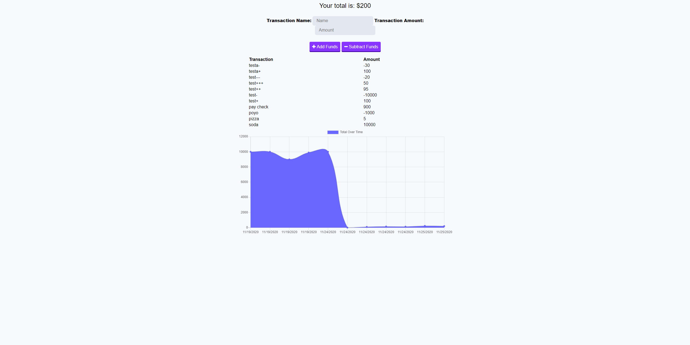

# budget-trackers

## Description 
Giving users a fast and easy way to track their money is important, but allowing them to access that information anytime is even more important. Having offline functionality is paramount to our applications success.

### Example imgage

## Table of contents
- [Description](#Description)
- [Installation](#Installation)
- [Usage](#Usage)
- [Licence](#Licence)
- [Contributors](#Contributors)
- [Test](#Test)
- [Repository Link](#Repository)
- [Heroku Link](#heroku)
- [GitHub Info](#GitHub) 
## Installation
  Run:

        npm i
        
## Usage
Start server

        node server.js

## Licence

## Contributors
Just me Jordan Kirby

## Test
no test

## Repository
- [budget-trackers](https://github.com/Feizhi255/budget-trackers)

## heroku
- [heroku link](https://salty-wildwood-36065.herokuapp.com/)
## GitHub

- Jordan Kirby
- [Feizhi255](https://github.com/Feizhi255)
## Questions? send me an email title it with the Repo name plz
- <jrock255@hotmail.com>